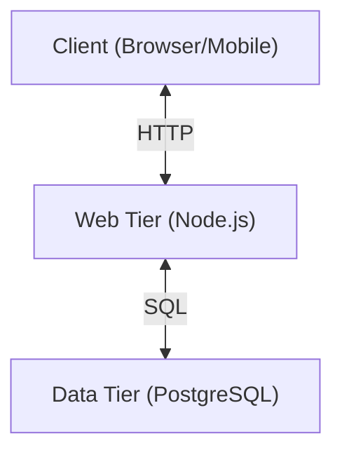

# 3-Tier Simple App

This project demonstrates the evolution of a web application from a single-server setup to a 3-tier architecture.

## Architecture



- **Tier 1 (Client)**: Web Browser / Mobile App (simulated)
- **Tier 2 (Web Server)**: Node.js Express Application
- **Tier 3 (Database)**: PostgreSQL (running via Docker Compose)

## Prerequisites

- **Node.js**: Installed on your machine.
- **Docker & Docker Compose**: Installed and running.

## Getting Started

### 1. Configuration (Secrets)
Since we follow security best practices, secrets are not committed to the repository. You must create a `.env` file in the project root:

**Create a file named `.env` and add:**
```env
POSTGRES_USER=postgres
POSTGRES_PASSWORD=mysecretpassword
POSTGRES_DB=postgres
```
*Note: `.env` is listed in `.gitignore` to prevent accidental commits.*

### 2. Start the Database (Data Tier)
We use Docker Compose to spin up the PostgreSQL database. This acts as our dedicated database server.

```bash
docker compose up -d
```
*This command reads the configuration from `docker-compose.yml` and secrets from your `.env` file.*

### 3. Initialize the Database
Run the initialization script to create the schema (tables) and seed initial data.

```bash
# Install dependencies first
npm install

# Run the initialization script
node db_init.js
```
*Output should say "Table 'users' created successfully" and "Data seeded successfully".*

### 4. Start the Web Server (Web Tier)
Start the Node.js application.

```bash
npm start
```
The server will run on `http://localhost:3000`.

## Testing
You can test the integration by querying the API:
```bash
curl http://localhost:3000/users/1
```
This request flows from the **Web Tier** to the **Data Tier**, fetches the "John Doe" record, and returns it to you.

## Project Structure
- `server.js`: The Web Application Server.
- `db.js`: Database connection module.
- `db_init.js`: Script to setup database schema.
- `docker-compose.yml`: Configuration for the Database Server (PostgreSQL).
- `system_design_notes.md`: Study notes on system architecture.
