# Simple Single Server App

A learning project to understand the basics of **System Design**, **HTTP**, and **Client-Server Architecture**.

```mermaid
graph TD
    subgraph User["User Devices"]
        Browser["💻 Web Browser"]
        Mobile["📱 Mobile App"]
    end

    DNS[("🌐 DNS Server")]
    Server["🖥️ Web Server (Node.js/Express)"]

    Browser -- "1. Lookup Domain" --> DNS
    Mobile -- "1. Lookup Domain" --> DNS
    DNS -- "2. Return IP" --> Browser
    DNS -- "2. Return IP" --> Mobile

    Browser -- "3. HTTP Request (GET /users/12)" --> Server
    Mobile -- "3. HTTP Request (GET /users/12)" --> Server
    
    Server -- "4. JSON Response (304/200 OK)" --> Browser
    Server -- "4. JSON Response (200 OK)" --> Mobile
```





## 🎯 Project Goal
To build a "Single Server" system from scratch that can handle requests from various clients (Web, Mobile, etc.) and serve JSON data.

## 📚 What We Learned
This repository demonstrates:
1.  **Node.js & Express**: Setting up a basic web server.
2.  **HTTP Protocol**: Understanding Requests, Responses, and Methods (GET).
3.  **API Design**: Serving JSON data at specific endpoints (`/users/12`).
4.  **CORS**: Handling Cross-Origin Resource Sharing for browser security.
5.  **Caching**: Understanding the `304 Not Modified` status and ETags.
6.  **Clients**: Simulating a Web Client using raw HTML/JS and `fetch()`.

*For detailed step-by-step learning notes, check out [System Design Notes](system_design_notes.md).*

## 🚀 How to Run

### 1. Start the Server
```bash
# Install dependencies (only first time)
npm install

# Start the server
node server.js
```
Expected output: `Server running on port 3000`

### 2. Run the Client
Open `index.html` in your favorite browser.
- You should see the User Profile data loaded dynamically.
- Open the **Developer Tools (F12) -> Network Tab** to see the HTTP requests.

## 📂 Project Structure
- `server.js`: The backend API handling logic.
- `index.html`: The frontend simulation.
- `system_design_notes.md`: Our learning journal and documentation.
