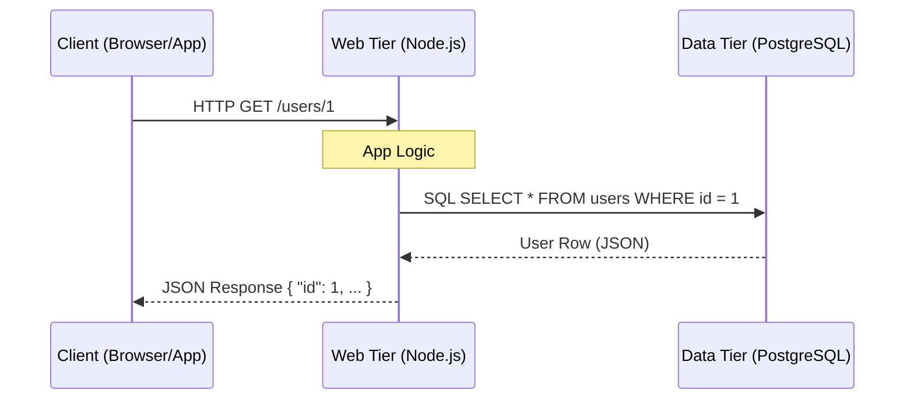
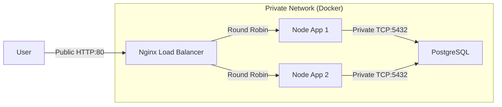

# System Design Notes

## Evolution: 2-Tier and 3-Tier Architecture

### The Problem with Single Server
With the growth of the user base, one server is not sufficient. We need multiple servers:
- **Web/Mobile Traffic (Web Tier)**: Handles HTTP requests, application logic.
- **Database (Data Tier)**: Stores user data persistently.

Separating these concerns allows them to be scaled independently.

### Architecture Overview

### Database Options

#### Relational Databases (RDBMS)
- **Examples**: MySQL, Oracle, PostgreSQL.
- **Structure**: **Tables** and **Rows**.
- **Key Feature**: SQL for data manipulation, supports joins.
- **Best for**: Structured data, complex relationships, ensuring data integrity (ACID properties).

#### Non-Relational Databases (NoSQL)
- **Examples**: CouchDB, Neo4j, Cassandra, DynamoDB.
- **Categories**: Key-value, Graph, Column, Document.
- **Key Feature**: Flexible schema, generally no joins.
- **Best for**: Super-low latency, unstructured data, massive scale, simple serialization (JSON/XML).

### Our Choice: PostgreSQL
We are choosing a **Relational Database (PostgreSQL)**.

#### What is a Schema?
In the context of a relational database, a **Schema** is the blueprint that defines the structure of your data. It organizes data into **Tables**, where each table has:
- **Columns**: Define the type of data (e.g., `first_name` which is text, `id` which is a number).
- **Rows**: The actual data records (e.g., "John Doe").

We defined our schema using SQL (Structured Query Language).

### Secret Management (Security Best Practices)
When dealing with databases, we have sensitive information like passwords.
- **NEVER** commit secrets (passwords, API keys) to version control (GitHub).
- **USE** Environment Variables. We use a `.env` file to store these secrets locally.
- **IGNORE** the `.env` file using `.gitignore` so it doesn't get uploaded.

In our architecture:
- Docker reads the `.env` file to configure the database.
- Our Node.js scripts use `dotenv` to read the same variables to connect.

### Independent Scaling
One of the main benefits of separating the Web Tier from the Data Tier is **Independent Scaling**.

- **Web Tier Scaling**: If we have too many users visiting the site, we can run multiple instances of our Node.js server (e.g., behind a Load Balancer) without needing to duplicate the database.
- **Data Tier Scaling**: If the database is the bottleneck, we can upgrade the database server hardware or add Read Replicas, without touching the web servers.

This decoupling allows us to optimize resources based on specific needs (compute vs storage/IO).

## Evolution: Load Balancer and Private Networking

### The Problem
In the previous setup, we accessed the Node.js server directly via `localhost:3000`. This allows for only **one** instance of the server. If that server crashes or gets overwhelmed, the site goes down.

### The Solution: Leveling Up
We introduced an **Nginx Load Balancer** sitting in front of multiple instances of our Node.js application.

### Key Implementation Details

#### 1. Containerization (`Dockerfile`)
**Why?** To run multiple copies (replicas) of our app easily, we must "package" it.
**Change:** Created a `Dockerfile` that defines the environment (Node 18), installs `package.json` dependencies, and exposes the internal port 3000.

#### 2. Load Balancer Configuration (`nginx.conf`)
**Why?** We need a traffic cop to distribute requests.
**Change:**
- Defined an `upstream web_app` block. In Docker Compose, the service name `web` resolves to *all* IP addresses of containers in that service. Nginx automatically load balances between them!
- Configured a `server` on port 80 to `proxy_pass http://web_app`.

#### 3. Private Networking & Security (`docker-compose.yml`)
**Why?** Web servers should not be open to the wild. Only the Load Balancer should be public.
**Change:**
- **Removed** `ports: "3000:3000"` from the `web` service. It is now completely invisible to the host machine's browser.
- **Added** `nginx` service with `ports: "80:80"`. This is the ONLY entry point.
- **DB Connection**: Since the web app is now in a container, it can't find `localhost` (which would refer to itself). We updated `db.js` to look for `process.env.DB_HOST`, which Docker sets to `db` (the service name).

#### 4. Observability (`server.js`)
**Why?** How do we *know* the load balancer is working?
**Change:** Added `server_id: os.hostname()` to the JSON response.
- `os.hostname()` inside a container returns the Container ID.
- Refreshing the page helps us see this ID toggle (e.g., Server A -> Server B), proving traffic distribution.

